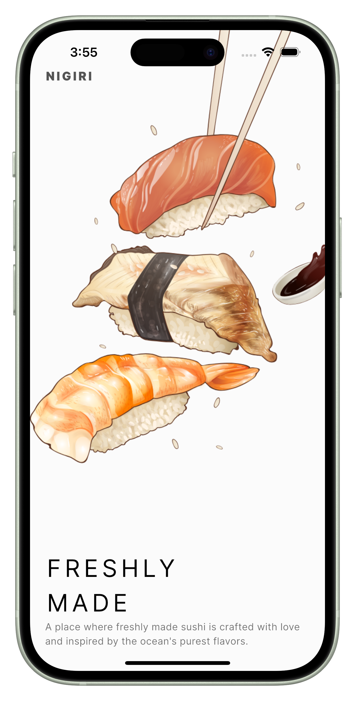
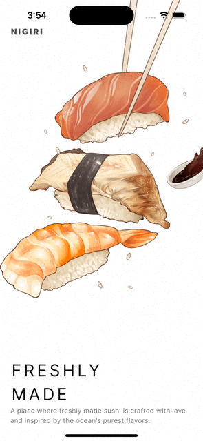

# NIGIRI

A single-screen splash sushi-themed UI with slide and fade animations.

## Key take points:
- Gained a better understanding how `Stack` and `Positioned` widgets works.
- Learned how to integrate slide and fade animations for both image and text widgets.

## Preview

### Static Screenshot

### Animation

